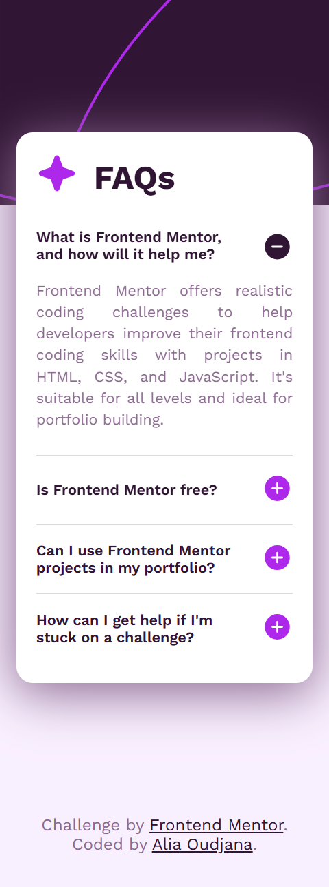

# FAQ accordion solution

This is a solution to the [FAQ accordion challenge on Frontend Mentor](https://www.frontendmentor.io/challenges/faq-accordion-wyfFdeBwBz).

## Table of contents

- [Overview](#overview)
  - [The challenge](#the-challenge)
  - [Screenshot](#screenshot)
  - [Links](#links)
- [Built with](#built-with)
- [Author](#author)

## Overview

### The challenge

Users should be able to:

- Hide/Show the answer to a question when the question is clicked
- Navigate the questions and hide/show answers using keyboard navigation alone
- View the optimal layout for the interface depending on their device's screen size
- See hover and focus states for all interactive elements on the page

### Screenshot

### Links

- Solution URL: https://github.com/AliaOudjana/faq-accordion-main
- Live Site URL: https://aliaoudjana.github.io/faq-accordion-main/

## My process

### Built with

- Semantic HTML5 markup
- SCSS
- Flexbox

## Author

- Frontend Mentor - [@AliaOudjana](https://www.frontendmentor.io/profile/AliaOudjana)
- LinkedIn - [@Alia-Oudjana](https://www.linkedin.com/in/alia-oudjana/)